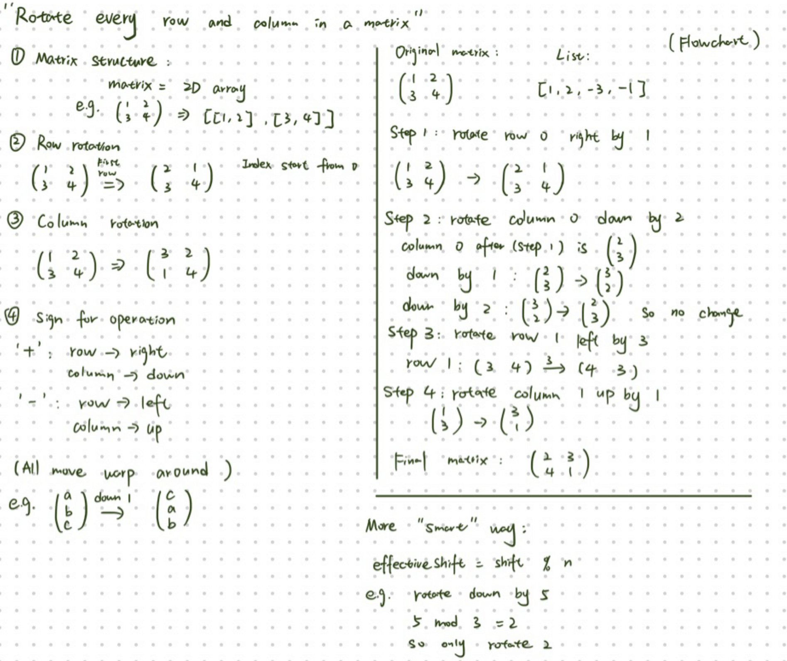

- Name: Zehan Wang
- Student ID: s2799443
- Tutorial group: 03C
- Tutor: Anna Kandyba
- Date: 2026-03-04

# Rotate every row and column in a matrix #

# Target audience #

Students who have completed roughly the first five weeks of this Java course. They can write small loop-based programs, but are new to 2D arrays (matrices) and to careful index manipulation.

# Prerequisite knowledge #

- `for` loops (including nested loops)
- 1D arrays and indexing (e.g., `arr[i]`)
- variables, assignment, and temporary variables
- reading and writing simple methods
- basic input/output (optional for this worksheet)

# Learning outcomes #

After completing this worksheet, the learner should be able to:

- explain what a matrix is in Java (a 2D array, e.g., `int[][]`)
- rotate a single row by one position using a temporary variable
- rotate a single column by one position using careful indexing
- test the program using small examples and a few edge cases

# Introduction #

Working with matrices is a common task in programming and appears in many areas such as graphics, data processing, and scientific computing.

In this worksheet we will explore how to rotate rows and columns in a matrix using simple Java constructs. The goal is to design an algorithm that beginners can understand and implement using loops and array indexing.

## Understanding the problem ##

In this worksheet, a *matrix* means a 2D array of integers, for example:

1 2 3
4 5 6

### Row rotation (by 1) ###

Rotating a row by 1 moves every element one step to the right, and the last element wraps around to the front.

Example: `[10, 20, 30, 40]` becomes `[40, 10, 20, 30]`.

### Column rotation (by 1) ###

Rotating a column by 1 moves every element one step down, and the bottom element wraps around to the top.

Example column: `[1, 2, 3]` becomes `[3, 1, 2]`.

## Observing the pattern ##

Before writing code, it helps to understand what the operations are doing to the matrix.

Each element in the list controls one rotation.  
The operations alternate between:

1. rotating a row
2. rotating a column

For an `n × n` matrix there will always be exactly `2n` numbers in the list.

The operations happen in this order:

1. rotate row 0
2. rotate column 0
3. rotate row 1
4. rotate column 1
5. continue until all rows and columns have been rotated once

Negative values mean the rotation goes in the opposite direction
(left for rows and up for columns).

---

## Example walkthrough ##

Consider the following matrix:

$$
\begin{pmatrix}
1 & 2 \\
3 & 4
\end{pmatrix}
$$

And the list:
[1, 2, -3, -1]

Step-by-step operations:
1. Rotate row 0 right by 1
$$
\begin{pmatrix}
2 & 1 \\
3 & 4
\end{pmatrix}
$$
2. Rotate column 0 down by 2
$$
\begin{pmatrix}
2 & 1 \\
3 & 4
\end{pmatrix}
$$
3. Rotate row 1 left by 3
$$
\begin{pmatrix}
2 & 1 \\
4 & 3
\end{pmatrix}
$$
4. Rotate column 1 up by 1
$$
\begin{pmatrix}
2 & 3 \\
4 & 1
\end{pmatrix}
$$

---

## Key idea for the algorithm ##

## Visualising the rotation ##

The following diagram illustrates how row and column rotations transform a matrix step by step.



The algorithm follows the order of the list:

- even positions control **row rotations**
- odd positions control **column rotations**

For each value we:

1. determine which row or column to rotate
2. determine the direction of rotation
3. rotate by the required amount using wrap-around

---

## Pseudocode design ##

A simple beginner-friendly design is:
```
for i from 0 to 2n-1:
    value = list[i]
    if i is even:
        rotate row (i/2)
    else:
        rotate column (i/2)

The rotation itself can be implemented using loops and temporary variables.
```
---

## Why this design is suitable for beginners ##

This design uses only basic programming concepts:

- loops
- arrays
- indexing
- simple conditional statements

Although more compact solutions exist, they often rely on advanced techniques that are harder for beginners to understand.  
This worksheet therefore prioritises **clarity and readability** over brevity.


# Original challenge question from CodeGolf #

[Rotate every row and column in a matrix](https://codegolf.stackexchange.com/q/74900 "Original CodeGolf challenge")

Plain text version of the challenge:

The Challenge

Given a n × n matrix of integers with n ≥ 2

$$
\begin{pmatrix}
1 & 2 \\
3 & 4
\end{pmatrix}
$$

and a list of integers with exactly 2n elements

[1,2,-3,-1]

output the rotated matrix. The matrix is constructed as follows:

Take the first integer in the list and rotate the first row to the right by this value.
Take the next integer and rotate the first column down by this value.
Take the next integer and rotate the second row to the right by this value.

Continue alternating between rows and columns until every row and column
has been rotated once.

Negative integers rotate in the opposite direction (left/up).
If the integer is zero, the row or column is not rotated.

<STYLE>
* { /* Don't leave any empty lines or IntelliJ might not render correctly */
  /* Text size */
  font-size:   1.1rem;
  /*font-size:   1.2rem;*/
  /* Zenburn dark theme */
  background-color: #2A252A;
  color:            #D5DAD5;
  /* One Dark theme */
  /*background-color: #282C34;
  color:            #ABB2BF;*/
  /* white-ish on dull blue-ish */
  /*background-color: DarkSlateGray;
    color:            AntiqueWhite;*/
  /* white on black */
  /*background-color: black;
  color: white;*/
  /* black on white */
  /*background-color: white;
  color: black;*/
  /* nearly black on bright yellow */
  /*background-color: #FFFFAA;
  color:            #080808;*/
  /* black on bright blue */  
  /*background-color: #99CCFF;
  color:            black;*/
}
body {
  /* width of the text column */
  width: 80%;
  /* line spacing */
  line-height: 180%;
  /*line-height: 200%;*/
  /* Font styles: */
  /* Default sans serif */
  /*font-family: sans-serif;*/
  /* Default serif */
  font-family: serif;
  /* Specific font with generic fall-back */
  /* font-family: "Calibri Light", sans-serif; */
  /*font-family: "OpenDyslexic", sans-serif;*/
}
pre,
code,
pre code {
  /* line spacing */
  line-height: 150%;
  /* Default monospace */
  font-family: monospace;
  /* Specific fixed-width font with generic fall-back */
  /*font-family: "Consolas", monospace;*/
  /*font-family: "OpenDyslexicMono", monospace;*/
}
ol,
ol ol,
ol ol ol { /* Nested lists all use decimal numbering */
  list-style-type: decimal;
}
em {
  /* if you want underlining instead of italics */
  /*font-style: normal;
  border-bottom-style: solid;
  border-bottom-width: 1px;
  padding-bottom:      2px;*/
  text-decoration-skip-ink: auto;
}
h2 { /* Put a horizontal line above major headings to assist screen viewing */
  border-top:  1px solid #D5DAD5;
  margin-top:  80px;
  padding-top: 20px;
  }
</STYLE>