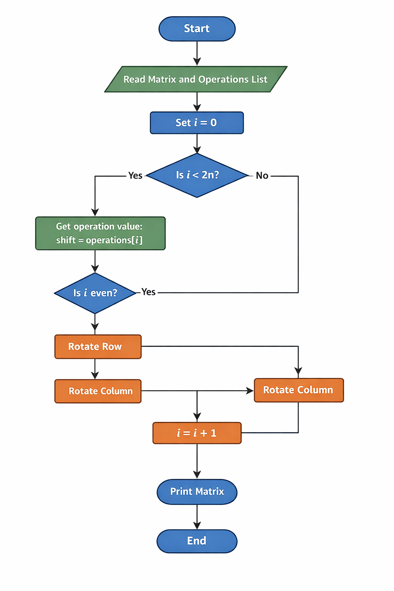

- Name: Zehan Wang
- Student ID: s2799443
- Tutorial group: 03C
- Tutor: Anna Kandyba
- Date: 2026-03-18

# Rotate every row and column in a matrix #

# Target audience #

Students who have completed roughly the first five weeks of this Java course. They can write small loop-based programs, but are new to 2D arrays (matrices) and to careful index manipulation.

# Prerequisite knowledge #

- `for` loops (including nested loops)
- 1D arrays and indexing (e.g., `arr[i]`)
- variables, assignment, and temporary variables
- reading and writing simple methods
- basic input/output (optional for this worksheet)

# Learning outcomes #

After completing this worksheet, the learner should be able to:

- explain what a matrix is in Java (a 2D array, e.g., `int[][]`)
- rotate a single row by one position using a temporary variable
- rotate a single column by one position using careful indexing
- test the program using small examples and a few edge cases

# Introduction #

Working with matrices is a common task in programming and appears in many areas such as graphics, data processing, and scientific computing.

In this worksheet we will explore how to rotate rows and columns in a matrix using simple Java constructs. The goal is to design an algorithm that beginners can understand and implement using loops and array indexing.

## Understanding the problem ##

In this worksheet, a *matrix* means a 2D array of integers.

You can think of a matrix as a table of numbers, like a spreadsheet:

1 2 3  
4 5 6

In Java, this is written as:

```
int[][] matrix = {
    {1, 2, 3},
    {4, 5, 6}
};
```
Each number has a position:

- The first index is the row
- The second index is the column

For example:

- `matrix[0][0]` = 1 (first row, first column)
- `matrix[1][2]` = 6 (second row, third column)

Understanding how positions work is very important, because the task
requires moving values to new positions.

---

### What does “rotation” mean? ###

A rotation means shifting values while keeping the size the same.

### Row rotation (by 1) ###

Example:

[10, 20, 30, 40] → [40, 10, 20, 30]

Explanation:

- The last element (40) moves to the front
- All other elements shift one position to the right

---

### Column rotation (by 1) ###

Example column:

[1, 2, 3] → [3, 1, 2]

Explanation:

- The bottom element (3) moves to the top
- All other elements shift down

## Observing the pattern ##

Before writing code, it helps to understand what the operations are doing to the matrix.

Each element in the list controls one rotation.  
The operations alternate between:

1. rotating a row
2. rotating a column

For an `n × n` matrix there will always be exactly `2n` numbers in the list.

The operations happen in this order:

1. rotate row 0
2. rotate column 0
3. rotate row 1
4. rotate column 1
5. continue until all rows and columns have been rotated once

Negative values mean the rotation goes in the opposite direction
(left for rows and up for columns).

---

## Example walkthrough ##

Matrix:

1 2  
3 4

Operations:
[1, 2, -3, -1]

---

Step 1: Rotate row 0 right by 1

Original row: [1, 2]  
After rotation: [2, 1]

Result:

2 1  
3 4

Explanation:
The last element (2) moves to the front.

---

Step 2: Rotate column 0 down by 2

Column size = 2  
2 % 2 = 0 → no change

Result:

2 1  
3 4

---

Step 3: Rotate row 1 left by 3

3 % 2 = 1 → same as left by 1

Row [3, 4] → [4, 3]

Result:

2 1  
4 3

---

Step 4: Rotate column 1 up by 1

Column [1, 3] → [3, 1]

Final result:

2 3  
4 1

---

## Key idea for the algorithm ##

The key idea is to avoid shifting elements one step at a time.

Instead, we calculate the final position of each element directly using:

newIndex = (currentIndex + shift) mod n

This allows the algorithm to perform rotations efficiently while also
handling wrap-around correctly.

## Visualising the rotation ##

Understanding matrix rotation can be difficult at first, so we use two
different types of diagrams.

---

### Concept explanation diagram ###

The following diagram explains the basic ideas behind matrix rotations,
including row rotation, column rotation, and how values wrap around.


This diagram is useful for beginners because it shows:

- how a matrix is represented in Java
- how row rotation works step by step
- how column rotation works step by step
- how positive and negative shifts affect direction
- how wrap-around movement works

---

### Algorithm flow diagram ###

The following flowchart shows how the algorithm processes the input:



This diagram focuses on the program logic:

- reading the input
- iterating through the operations
- deciding whether to rotate a row or column
- applying the rotation
- producing the final matrix

---

### Why two diagrams are used ###

The first diagram explains *what is happening* (conceptual understanding).

The second diagram explains *how the program works* (algorithm flow).

Using both diagrams together helps beginners understand both the idea
and the implementation.

The algorithm follows the order of the list:

- even positions control **row rotations**
- odd positions control **column rotations**

For each value we:

1. convert large shifts using modulo (to avoid unnecessary work)
2. compute the final position directly instead of shifting step by step
3. use a temporary array to safely move values

---

## Pseudocode design ##

We process each operation one by one:

```
for i from 0 to 2n-1:
    value = list[i]
    if i is even:
        // we are rotating a row
        rowIndex = i / 2
        rotate the row at rowIndex
    else:
        // we are rotating a column
        columnIndex = i / 2
        rotate the column at columnIndex
```
The rotation itself can be implemented using loops and temporary variables.

### How a row rotation works

create a temporary array temp of size n

for each position j in the row:
    newIndex = (j + shift) mod n
    temp[newIndex] = matrix[row][j]

    copy temp back into the row

Explanation:

- `(j + shift)` moves the element to the right
- `mod n` ensures wrap-around when reaching the end
- we use a temporary array to avoid overwriting values too early

### How a column rotation works
create a temporary array temp of size n

for each position i in the column:
    newIndex = (i + shift) mod n
    temp[newIndex] = matrix[i][column]

copy temp back into the column

This works the same way as row rotation, but we move values vertically
instead of horizontally.
---

## How the algorithm connects to the code ##

The Java program follows exactly the same steps as the pseudocode.

- A loop processes each operation in order
- Even indices rotate rows, odd indices rotate columns
- The shift value is reduced using modulo:

  shift = shift % n

This avoids unnecessary work when the shift is larger than the matrix size.

A temporary array is used to store results before copying them back.
This prevents values from being overwritten too early.

This design makes the code easier to understand and avoids errors.

## Why this design is suitable for beginners ##

This design uses only basic programming concepts:

- loops
- arrays
- indexing
- simple conditional statements

Although more compact solutions exist, they often rely on advanced techniques that are harder for beginners to understand.  
This worksheet therefore prioritises **clarity and readability** over brevity.


# Original challenge question from CodeGolf #

[Rotate every row and column in a matrix](https://codegolf.stackexchange.com/q/74900 "Original CodeGolf challenge")

Plain text version of the challenge:

The Challenge

Given a n × n matrix of integers with n ≥ 2

$$
\begin{pmatrix}
1 & 2 \\
3 & 4
\end{pmatrix}
$$

and a list of integers with exactly 2n elements

[1,2,-3,-1]

output the rotated matrix. The matrix is constructed as follows:

Take the first integer in the list and rotate the first row to the right by this value.
Take the next integer and rotate the first column down by this value.
Take the next integer and rotate the second row to the right by this value.

Continue alternating between rows and columns until every row and column
has been rotated once.

Negative integers rotate in the opposite direction (left/up).
If the integer is zero, the row or column is not rotated.

<STYLE>
* { /* Don't leave any empty lines or IntelliJ might not render correctly */
  /* Text size */
  font-size:   1.1rem;
  /*font-size:   1.2rem;*/
  /* Zenburn dark theme */
  background-color: #2A252A;
  color:            #D5DAD5;
  /* One Dark theme */
  /*background-color: #282C34;
  color:            #ABB2BF;*/
  /* white-ish on dull blue-ish */
  /*background-color: DarkSlateGray;
    color:            AntiqueWhite;*/
  /* white on black */
  /*background-color: black;
  color: white;*/
  /* black on white */
  /*background-color: white;
  color: black;*/
  /* nearly black on bright yellow */
  /*background-color: #FFFFAA;
  color:            #080808;*/
  /* black on bright blue */  
  /*background-color: #99CCFF;
  color:            black;*/
}
body {
  /* width of the text column */
  width: 80%;
  /* line spacing */
  line-height: 180%;
  /*line-height: 200%;*/
  /* Font styles: */
  /* Default sans serif */
  /*font-family: sans-serif;*/
  /* Default serif */
  font-family: serif;
  /* Specific font with generic fall-back */
  /* font-family: "Calibri Light", sans-serif; */
  /*font-family: "OpenDyslexic", sans-serif;*/
}
pre,
code,
pre code {
  /* line spacing */
  line-height: 150%;
  /* Default monospace */
  font-family: monospace;
  /* Specific fixed-width font with generic fall-back */
  /*font-family: "Consolas", monospace;*/
  /*font-family: "OpenDyslexicMono", monospace;*/
}
ol,
ol ol,
ol ol ol { /* Nested lists all use decimal numbering */
  list-style-type: decimal;
}
em {
  /* if you want underlining instead of italics */
  /*font-style: normal;
  border-bottom-style: solid;
  border-bottom-width: 1px;
  padding-bottom:      2px;*/
  text-decoration-skip-ink: auto;
}
h2 { /* Put a horizontal line above major headings to assist screen viewing */
  border-top:  1px solid #D5DAD5;
  margin-top:  80px;
  padding-top: 20px;
  }
</STYLE>